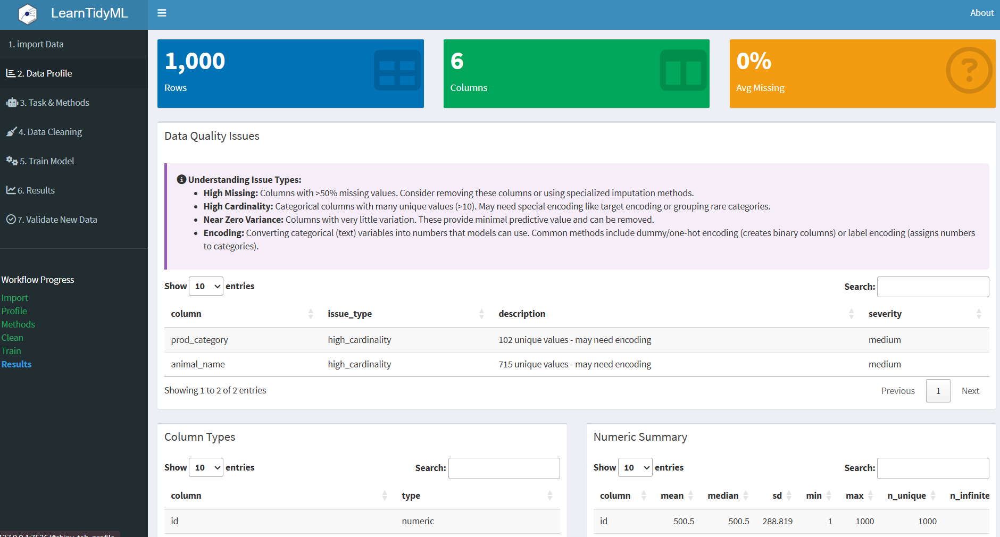
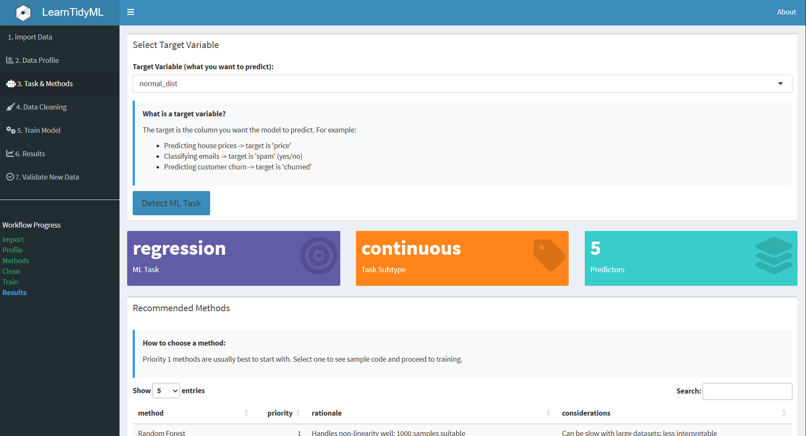
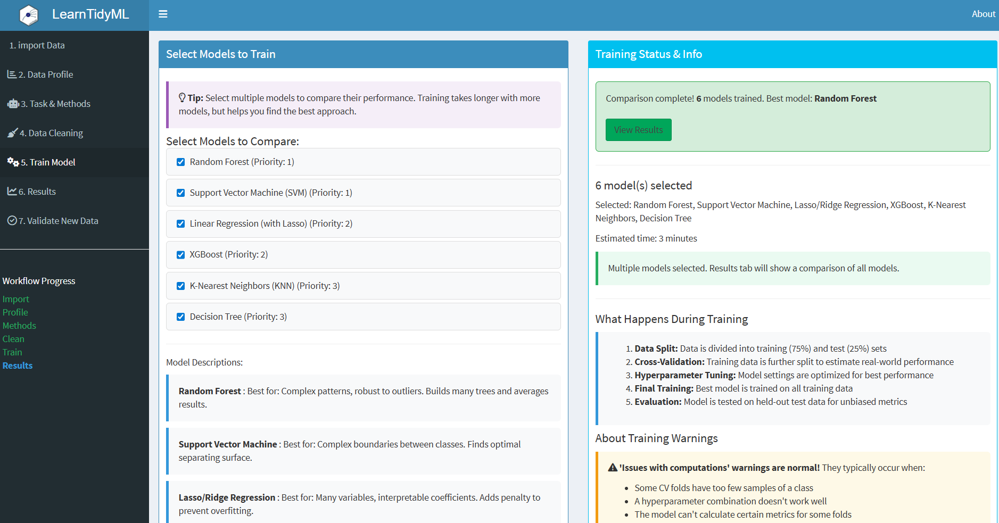
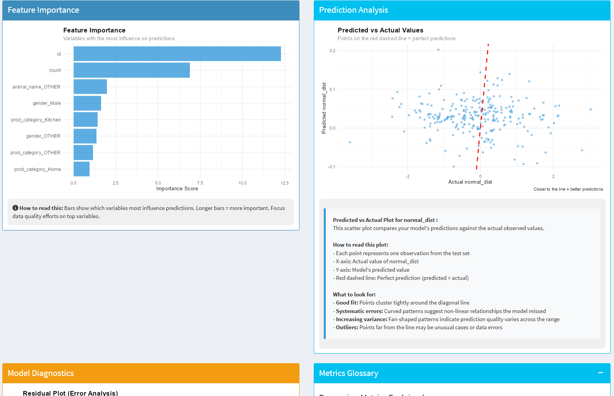

# LearnTidyML 

**Machine Learning Method Assistant**

An interactive R package with Shiny interface that helps users select appropriate machine learning methods based on their data characteristics. Designed for educational use and to guide ML workflow decisions.

## Overview

LearnTidyML takes the guesswork out of choosing machine learning methods. import your data, and LearnTidyML will:

1. **Profile your data** - Understand structure, types, and quality
2. **Detect the ML task** - Classification, regression, clustering, etc.
3. **Recommend methods** - Suggest appropriate algorithms with explanations
4. **Clean your data** - Handle missing values, outliers, and transformations
5. **Train models** - Build and compare multiple models automatically
6. **Explain results** - Plain-English interpretations of model performance

Perfect for students, researchers, and practitioners learning machine learning workflows.

## Features

- **Automated Data Profiling** - Comprehensive data quality assessment
- **Intelligent Task Detection** - Automatically identifies ML problem type
- **Method Recommendations** - Suggests algorithms with clear explanations
- **Guided Data Cleaning** - Interactive data preparation workflow
- **Model Training & Comparison** - Train multiple models simultaneously
- **Plain-English Explanations** - Results explained without jargon
- **Statistical Validation** - Proper cross-validation and metrics
- **Educational Focus** - Learn ML concepts through guided workflows

## Screenshots

### Data Profiling


### Method Recommendations


### Model Training & Comparison


### Results & Explanations


## Installation

```r
# Recommended: Install from GitHub
devtools::install_github("jasongeslois/LearnTidyML")

# Alternative: Install from local source
devtools::install_local("path/to/LearnTidyML")
```

## Quick Start

```r
library(LearnTidyML)

# Launch the app (opens in browser)
launch_LearnTidyML()

# Launch in RStudio viewer
launch_LearnTidyML(launch.browser = FALSE)
```

## Workflow Guide

### Step 1: import Data

**Supported formats:**
- CSV, TSV, TXT (delimited text)
- Excel (.xlsx, .xls)
- R data (.rds, .RData)
- Statistical formats (.sas7bdat, .xpt, .dta, .sav)

**Approximate file size limit:** 50 MB

### Step 2: Data Profile

Automatic analysis includes:
- **Column types** - Numeric, categorical, date, text
- **Missing values** - Percentage and patterns
- **Distributions** - Visual summaries
- **Outliers** - Statistical detection
- **Correlations** - Relationship analysis

### Step 3: Task & Methods

**LearnTidyML detects:**
- Binary Classification
- Multi-class Classification
- Regression
- Clustering
- Time Series (potential future support)

**Recommendations include:**
- Suitable algorithms for your task
- Why each method is appropriate
- When to use vs. avoid each method
- Complexity and interpretability trade-offs

### Step 4: Data Cleaning

Interactive tools for:
- **Missing values** - Imputation or removal
- **Outliers** - Transformation or capping
- **Scaling** - Normalization, standardization
- **Encoding** - Categorical variable handling
- **Feature engineering** - Derived variables

### Step 5: Train Model

**Single model training:**
- Choose one algorithm
- Configure hyperparameters
- Train with cross-validation
- View performance metrics

**Model comparison:**
- Train multiple models simultaneously
- Compare performance side-by-side
- Automatic hyperparameter tuning
- Identify best performer

### Step 6: Results

**Performance metrics:**
- **Classification**: Accuracy, Precision, Recall, F1, ROC-AUC
- **Regression**: RMSE, MAE, R-squared, MAPE
- **Statistical tests**: Validation of results

**Visualizations:**
- Confusion matrices (classification)
- Actual vs. Predicted plots (regression)
- Feature importance
- Learning curves

**Plain-English explanations:**
- What the metrics mean
- How good the model is
- What to do next

### Step 7: Validate New Data

import new data to:
- Test trained model on unseen data
- Validate generalization
- Make predictions
- Export results

## Supported ML Methods

### Classification
- **Logistic Regression** - Simple, interpretable baseline
- **Decision Tree** - Easy to visualize and explain
- **Random Forest** - Robust ensemble method
- **Gradient Boosting (XGBoost)** - High-performance ensemble
- **Support Vector Machine** - Effective for high-dimensional data
- **K-Nearest Neighbors** - Instance-based learning
- **Naive Bayes** - Fast probabilistic classifier

### Regression
- **Linear Regression** - Simple, interpretable baseline
- **Ridge/Lasso Regression** - Regularized linear models
- **Decision Tree** - Non-linear relationships
- **Random Forest** - Robust ensemble
- **Gradient Boosting (XGBoost)** - High-performance
- **Support Vector Regression** - Effective for complex patterns
- **K-Nearest Neighbors** - Local averaging

## System Requirements

### Required Packages
Automatically installed with LearnTidyML:
```r
# Core packages
shiny, shinydashboard, shinyjs, dplyr, tidyr, ggplot2

# ML framework (tidymodels)
tidymodels, parsnip, recipes, workflows, tune, yardstick, rsample

# Data handling
readr, readxl, haven, DT, skimr

# Utilities
glue, stringr, tibble, magrittr, rlang, markdown, knitr
```

### Optional ML Engine Packages
For full functionality, install:
```r
install.packages(c(
  "glmnet",      # Ridge/Lasso
  "ranger",      # Random Forest
  "xgboost",     # Gradient Boosting
  "kernlab",     # SVM
  "kknn",        # K-Nearest Neighbors
  "naivebayes",  # Naive Bayes
  "rpart",       # Decision Trees
  "rpart.plot",  # Tree visualization
  "vip"          # Feature importance
))
```

### System Requirements
- **R**: 4.0.0 or higher
- **RAM**: 4 GB minimum, 8 GB+ recommended
- **Storage**: 500 MB for packages and data
- **Browser**: Modern web browser (Chrome, Firefox, Edge)

## Educational Design Philosophy

LearnTidyML is built on these principles:

### 1. Guided Learning
- Step-by-step workflow mirrors real ML projects
- Each step builds on previous knowledge
- Clear visual progress tracking

### 2. Plain-English Explanations
- Avoid jargon where possible
- Explain metrics in practical terms
- Provide context for decisions

### 3. Best Practices Built-In
- Proper train/test splitting
- Cross-validation by default
- Appropriate metrics for each task
- Statistical validation

### 4. Learn by Doing
- Interactive experimentation
- Immediate visual feedback
- Compare methods empirically
- Understand trade-offs through experience

## Use Cases

### Academic Education
- **Courses**: Intro to ML, Data Mining, Statistics
- **Labs**: Hands-on ML practice without coding
- **Assignments**: Explore algorithms and concepts
- **Demonstrations**: Instructor tool for teaching

### Self-Learning
- **ML Beginners**: Learn workflow without overwhelming code
- **R Users**: Transition to ML with familiar environment
- **Career Development**: Build ML intuition
- **Experimentation**: Test ideas quickly

### Research Support
- **Exploratory Analysis**: Quick method screening
- **Baseline Models**: Establish performance benchmarks
- **Method Comparison**: Evaluate algorithm suitability
- **Reproducibility**: Document ML decisions

### Professional Use
- **Prototyping**: Rapid model development
- **Client Demos**: Show ML capabilities interactively
- **Training**: Onboard new team members
- **Documentation**: Explain model selection rationale

## Key Features Explained

### Automated Task Detection

LearnTidyML analyzes your data to determine:
- **Target variable type** - Continuous, binary, multi-class
- **Problem structure** - Supervised vs. unsupervised
- **Data characteristics** - Size, complexity, class balance

### Method Recommendation Engine

Recommendations consider:
- Task type (classification, regression)
- Dataset size
- Number of features
- Class balance (classification)
- Interpretability needs
- Computational complexity

### Statistical Validation

Built-in validation ensures:
- Stratified sampling for classification
- Proper cross-validation
- Appropriate metrics for task
- Significance testing where applicable
- Warning for common pitfalls

## Known Limitations

1. **Maximum file size**: 50 MB import limit
2. **Memory constraints**: Large datasets may cause slowdowns
3. **Simplified hyperparameter tuning**: Basic grid search only
4. **No deep learning**: Focus on traditional ML methods
5. **English only**: UI and explanations in English
6. **Simplified assumptions**: Some statistical checks are heuristic-based

## Security & Privacy

- **Local execution**: All processing happens on your machine
- **No data transmission**: Your data never leaves your computer
- **Session isolation**: Each session is independent
- **Automatic cleanup**: Data cleared when session ends
- **File import limits**: 50 MB max to prevent resource abuse

## Troubleshooting

### App won't start
```r
# Reinstall package
devtools::install_github("jasongeslois/LearnTidyML")
library(LearnTidyML)
launch_LearnTidyML()
```

### Model training fails
- Check for missing ML engine packages (see Optional ML Engine Packages)
- Verify data has no missing values after cleaning
- Ensure target variable is appropriate for task

### Slow performance
- Reduce dataset size (sample rows)
- Use fewer cross-validation folds
- Choose simpler models first
- Close other R sessions

### File import rejected
- Check file format (see supported formats)
- Verify file size under 50 MB
- Ensure file is not corrupted

## Best Practices

### Data Preparation
1. **Clean data first** - Handle obvious errors before import
2. **Meaningful target** - Ensure target variable makes sense
3. **Sufficient rows** - At least 100 rows for meaningful results
4. **Representative sample** - Ensure data reflects real-world distribution

### Model Selection
1. **Start simple** - Try logistic/linear regression first
2. **Compare multiple methods** - Use comparison mode
3. **Consider interpretability** - Simpler models often better for explanation
4. **Validate assumptions** - Review statistical checks

### Evaluation
1. **Use appropriate metrics** - Different tasks need different metrics
2. **Consider context** - High accuracy isn't always what you need
3. **Check for overfitting** - Training vs. validation performance
4. **Test on new data** - Use Step 7 for validation

## Future Enhancements

Potential features for future versions or additional related family of packages:
- Deep learning support (neural networks)
- Advanced hyperparameter tuning (Bayesian optimization)
- Feature selection algorithms
- Ensemble model building
- Model export for production use
- Automated report generation
- Time series forecasting
- Anomaly detection

## References

### Machine Learning
- Hastie, T., Tibshirani, R., & Friedman, J. (2009). "The Elements of Statistical Learning"
- James, G., Witten, D., Hastie, T., & Tibshirani, R. (2013). "An Introduction to Statistical Learning"

### R Ecosystem
- **tidymodels**: Modern ML framework for R
- **parsnip**: Unified ML interface
- **recipes**: Feature engineering framework

### Development Environment
R version 4.4.3 by The R Foundation: "https://www.r-project.org/"

Positron 2025.11.0 by Posit: "https://positron.posit.co/" 

Developed with AI coding assistance:

Claude Sonnet 4.5 and Claude Opus 4.5 (Anthropic) for core structure and logic. https://claude.ai/code

Gemini 3.0 (Google) for debugging and verification. https://gemini.google.com/app

## Credits

**Created By**: Jason Geslois 
**Version**: 0.3.0 
**License**: MIT 

## Contributing

Suggestions and bug reports welcome! This is an educational project focused on teaching ML concepts through interactive exploration.

## License

MIT License - See LICENSE file for details

---

**Disclaimer**: LearnTidyML is designed for educational purposes. For production ML systems, consult with data science professionals and follow rigorous validation procedures.

**Built with R, Shiny, and tidymodels**
*Learn machine learning through guided exploration*
